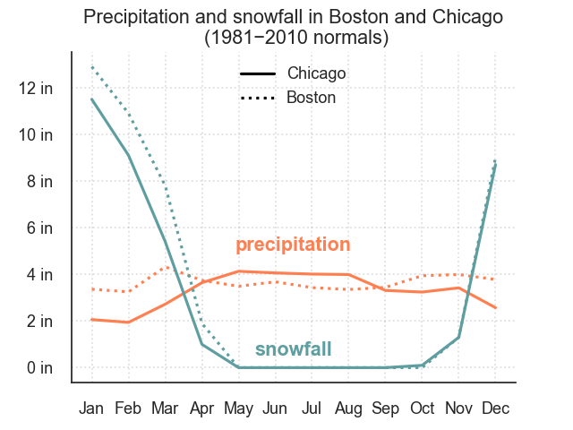

# US weather visualisation
Visualise average yearly trends of weather phenomena in two US cities

### Data
Weather phenomena data was obtained from Wikipedia and Data should be saved in local folder [Data] in .csv format.   
* Weather in [Boston (Massachusetts)](https://en.wikipedia.org/wiki/Boston#Climate)
* Weather in [Chicago (Illinois)](https://en.wikipedia.org/wiki/Chicago#Climate)   

### Source code
[US-weather.ipynb](US-weather.ipynb) in folder [src] contains the Jupyter notebook code to visualise average weather phenomena in Boston and Chicago

### Output

